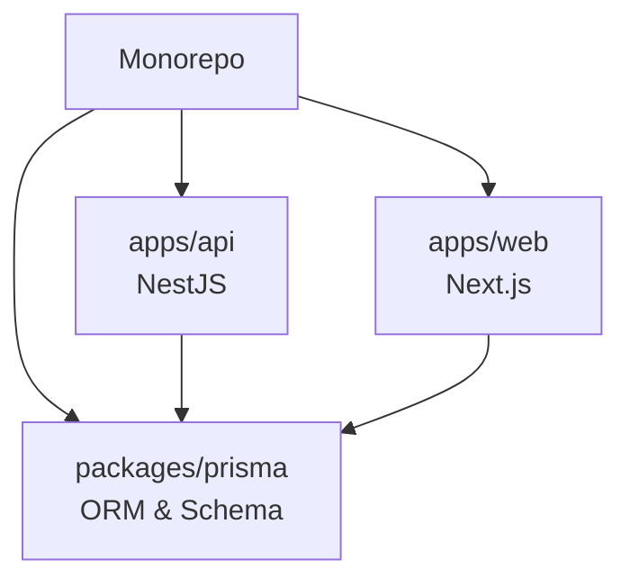

# System Architecture & Infrastructure

> **Objective:** Establish a developer-friendly Monorepo and a resilient, proxy-based production VPS environment.

---

## 🏗️ Monorepo Topology (Turborepo + PNPM)

A unified repository maximizing code sharing and minimizing build times.

| Layer | Technology | Benefit |
| :--- | :--- | :--- |
| **Workspaces** | PNPM | Isolated dependencies with deduplicated storage (`.pnpm`). |
| **Build System** | Turborepo | Parallel execution and robust build caching (`.turbo`). |
| **Shared Code** | Prisma | Single source of truth for database models and types across frontend and backend. |

---

## 🐳 Docker Containerization

Production-ready, multi-stage Dockerfiles.

- **Multi-stage Builds**: Separation of `builder` (installs dev dependencies and compiles) and `runner` (contains only the compiled binary/standalone files).
- **Isolation**: Each microservice operates in its own sandboxed container environment.

---

## 🔀 Reverse Proxy (Traefik)

Automated entrypoint routing and SSL termination.

- **Dynamic Discovery**: Traefik reads Docker labels to auto-configure routes on the fly.
- **Let's Encrypt**: Zero-touch TLS certificate generation via ACME (`tlschallenge`).
- **Network Structure**:
  - `gateway_network`: External exposed network for Traefik <-> App boundaries.
  - `default`: Internal bridge for API <-> Database communication.

---

## 🤖 CI/CD Pipeline (GitHub Actions)

Continuous Deployment workflow.

1. **Build & Push**: Compiles Next.js/NestJS and pushes images to `ghcr.io`.
2. **Environment Injection**: Securely injects GitHub Secrets into a remote VPS `.env` file via heredocs.
3. **Rolling Update**: Connects via SSH and executes `docker compose pull && docker compose up -d`.
